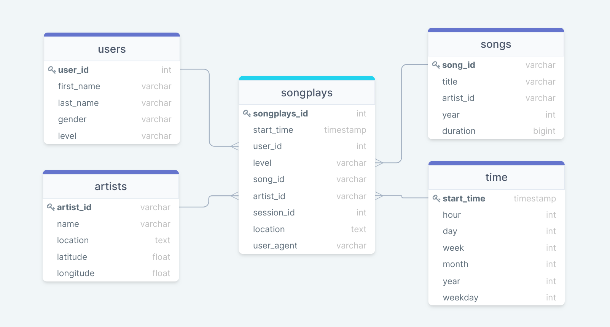
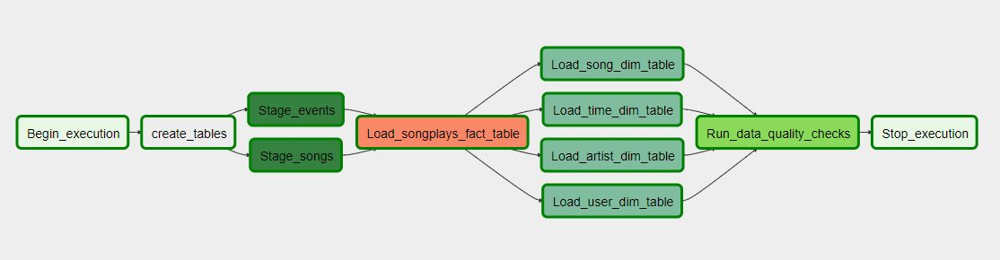
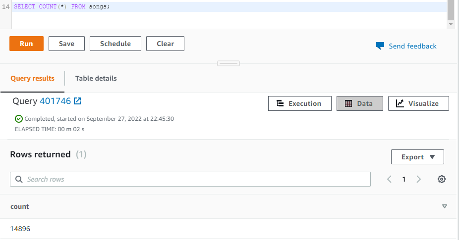

 

# Data-Pipeline-Apache-Airflow

## Overview
This project is about building an Airflow ETL Pipeline for Sparkify Company. The company wants to automate and monitor their data warehousing ETL on AWS.
The source data resides in S3 and needs to be processed in Sparkify's data warehouse in Amazon Redshift. The source datasets consist of JSON logs that tell about user activity in the application and JSON metadata about the songs the users listen to. Also, wants Data Quality tests to run against their datasets after the ETL steps have been executed to catch any discrepancies in the datasets.

## Project Dataset
There are two datasets that reside in S3:

- Song data: `s3://udacity-dend/song_data`
- Log data: `s3://udacity-dend/log_data`

## Database Schema Design

        
## Project Files
1. `Create_tables.sql`: Contains CREATE SQL statements. 
#### DAG
2. `sparkify_dag`: Has all the imports and task templates in place and task dependencies.
#### Operators
3. `stage_redshift.py`: Loads data from S3 to Redshift, The operator creates and runs a SQL COPY statement based on the parameters provided.
4. `load_dimension.py`: Loads and transforms data from staging tables to dimension tables.
5. `load_fact.py`: Loads and transforms data from staging tables to fact tables.
6. `data_quality`: Creates the data quality operator, which is used to run checks on the data itself.
#### Helpers
7. `sql_queries.py`: For the SQL transformations.

## Data Pipeline
Will use Airflow to create the ETL pipeline. The Data Pipeline steps consist of:
1. load data from `S3` to the staging table in `Amazon Redshift` for this task I created `StageToRedshiftOperator` in the `stage_redshift.py` file. The operator creates and runs a SQL COPY statement based on the parameters provided.
2. load data from staging table to dimension tables, I created `LoadDimensionOperator`. Dimension loads are often done with the truncate-insert pattern where the target table is emptied before the load. 
3. load data from staging table to fact tables, I created `LoadFactOperator`.
4. It's important to check the quality. So, I created the `DataQuailtyOperator`. The operator's main functionality is to receive one or more SQL-based test cases along with the expected results and execute the tests. For each test, the test result and expected result needs to be checked and if there is no match, the operator should raise an exception and the task should retry and fail eventually.
5. It's very important to define the task dependencies.

*Visualization of the DAG*

After the DAG is finished, I go to the Redshift query editor to check the data.

*Query Example in Redshift query editor*

## Prerequisites:
1. Create an IAM User in AWS.  
Attach Policies: `AdministratorAccess`, `AmazonRedshiftFullAccess` and `AmazonS3FullAccess`

2. Create a redshift cluster.

## Airflow Connection:
1. Connect Airflow and AWS (AWS Credentials).  
Run `/opt/airflow/start.sh`, Click on the Admin tab and select Connections.  
Then create Amazon Web Services conn you will Enter `Access Key` in login and `Secret key` in password from the IAM User credentials.

2. Connect Airflow to the AWS Redshift Cluster.  
Create Postgres Conn with credentials to Redshift

## How to run 
  
Run `/opt/airflow/start.sh`.

## Author
Esraa Ahmed | 

Created on 28/09/2022
